# superconductivity

A research-oriented Python toolbox for mesoscopic superconducting transport: BCS tunneling, Andreev bound states, MAR-style I–V models, photon-assisted tunneling (PAT), and Josephson/RSJ dynamics. The code is written to be used on real experimental data (units, interpolation, reproducible plotting helpers), and to keep a curated public API via `superconductivity.api`.

This repository also contains a set of theory figures (from the thesis material in `thesis/theory/`) that are exported into `docs/assets/` and embedded below.

---

## Install

Editable install for development:

```bash
python -m pip install -e .
```

Virtual environment (example):

```bash
source ~/Documents/.venv/bin/activate
deactivate
```

---

## Quickstart

The public API is intentionally re-exported so that you can do:

```python
import superconductivity.api as sc
```

All currents/voltages use the “lab units” conventions used throughout the thesis codebase (e.g. `V_mV`, currents in `nA`, energies in `meV`).

BCS tunnel I–V (JAX-backed implementation, NumPy-like API):

```python
import numpy as np
import superconductivity.api as sc

V_mV = np.linspace(-1.0, 1.0, 2001)
I_nA = sc.get_I_bcs_nA(V_mV, G_N=1.0, T_K=0.05, Delta_meV=(0.18, 0.18), gamma_meV=(1e-3, 1e-3))
```

Photon-assisted tunneling (Tien-Gordon style, discrete sidebands):

```python
A_mV = np.linspace(0.0, 0.6, 61)          # microwave amplitude (mV)
I_pat_nA = sc.get_I_pat_nA(V_mV=V_mV, I_nA=I_nA, A_mV=A_mV, nu_GHz=10.0, n_max=80, m=1)  # shape (Na, Nv)
```

Symmetric HA-style MAR I–V (single-channel transmission `tau`):

```python
I_mar_nA = sc.get_I_ha_nA(V_mV, tau=0.8, T_K=0.02, Delta_meV=0.18, gamma_meV=1e-4)
```

RSJ “Shapiro map” style workflow (DC current from a driven RSJ model):

```python
I_bias = np.linspace(-4.5, 4.5, 201)
V_bias = np.linspace(-2.0, 2.0, 2001)
A_bias = np.linspace(0.0, 1.0, 121)

I_map_nA = sc.get_I_rsj_nA(
    V_bias=V_bias,
    I_bias=I_bias,
    A_bias=A_bias,
    G_N=1.0,
    I_SW=1.0,
    Delta_meV=0.18,
    T_K=0.0,
    gamma_meV=1e-3,
    nu_GHz=10.0,
    n_max=80,
)
```

Andreev bound states / current-phase relation:

```python
phi = np.linspace(-np.pi, np.pi, 2001)
E_meV = sc.get_E_abs_meV(phi, tau=0.8, Delta_meV=0.18)
I_cpr_nA = sc.get_cpr_abs_nA(phi, tau=0.8, Delta_meV=0.18)
Ic_nA = sc.get_Ic_abs_nA(tau=0.8, Delta_meV=0.18)
```

---

## What's in the curated API?

`superconductivity.api` re-exports the functions/constants that are used most frequently in day-to-day evaluation scripts.

Core model families (representative entry points):
- BCS tunneling / DOS: `get_dos`, `get_f`, `get_Delta_meV`, `get_I_bcs_nA`
- PAT (Tien-Gordon): `get_I_pat_nA`
- BTK: `get_I_btk_nA`, `get_Z_btk`, `get_AB_btk`
- Andreev bound states / CPR: `get_E_abs_meV`, `get_cpr_abs_nA`, plus KO/AB variants and critical currents (`get_Ic_*`)
- MAR-style I-V: `get_I_ha_nA` (symmetric) and `get_I_ha_asym_nA` (asymmetric if needed)
- FCS-based model: `get_I_fcs_nA`
- RSJ / driven Josephson response: `get_I_rsj_nA`, `get_I_rsj_meso_nA`

Plotting / style helpers:
- colors: `get_colors`, `get_color`, plus "seeblau/seegrau" palettes
- figure helpers: `get_figure`, `theory_layout`, `map_layout`

Utilities/constants:
- `G_0_muS`, `k_B_meV`, `h_e_pVs`
- helper functions: `oversample`, `bin_y_over_x`, JAX interpolation `jnp_interp_y_of_x`

---

## Theory figure gallery (from `thesis/theory/*`)

These figures are exported to `thesis/theory/` (PNG) and embedded here to provide a quick visual index of the models implemented in the package.

### Microscopic / tunneling / PAT

<p align="center">
  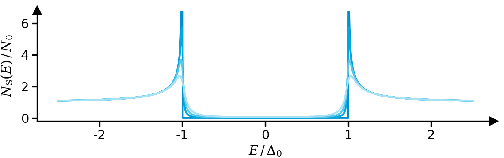
  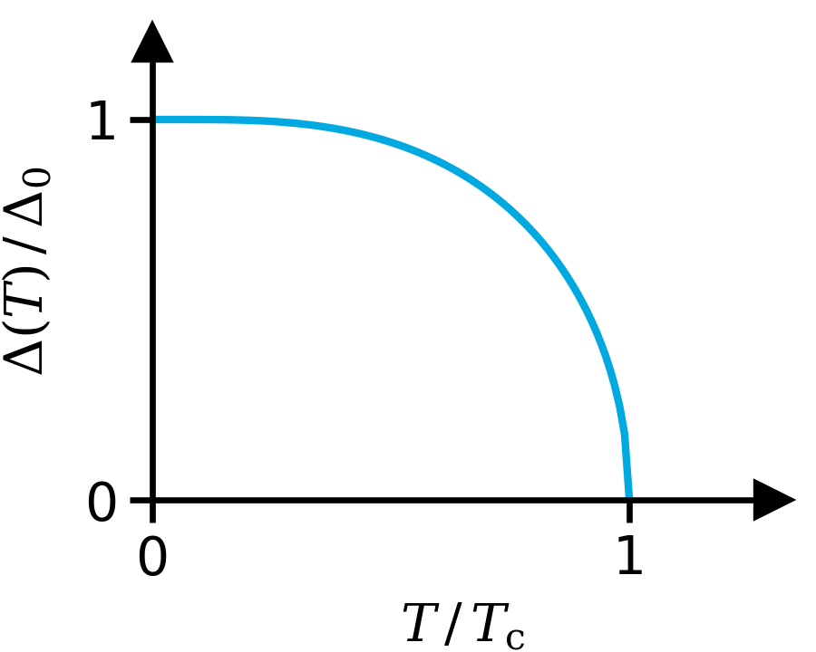
  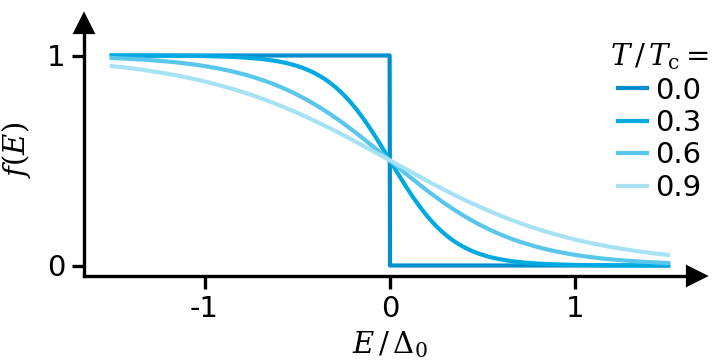
</p>

<p align="center">
  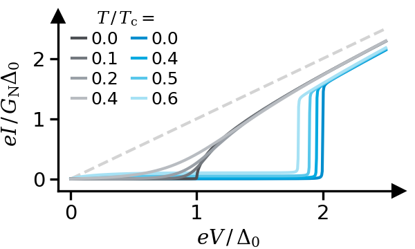
  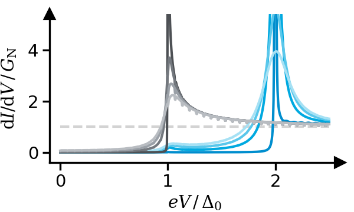
  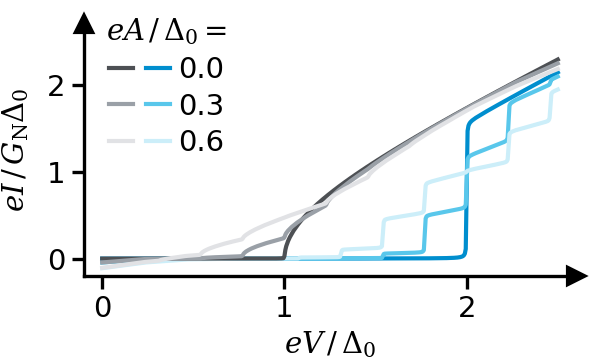
</p>

<p align="center">
  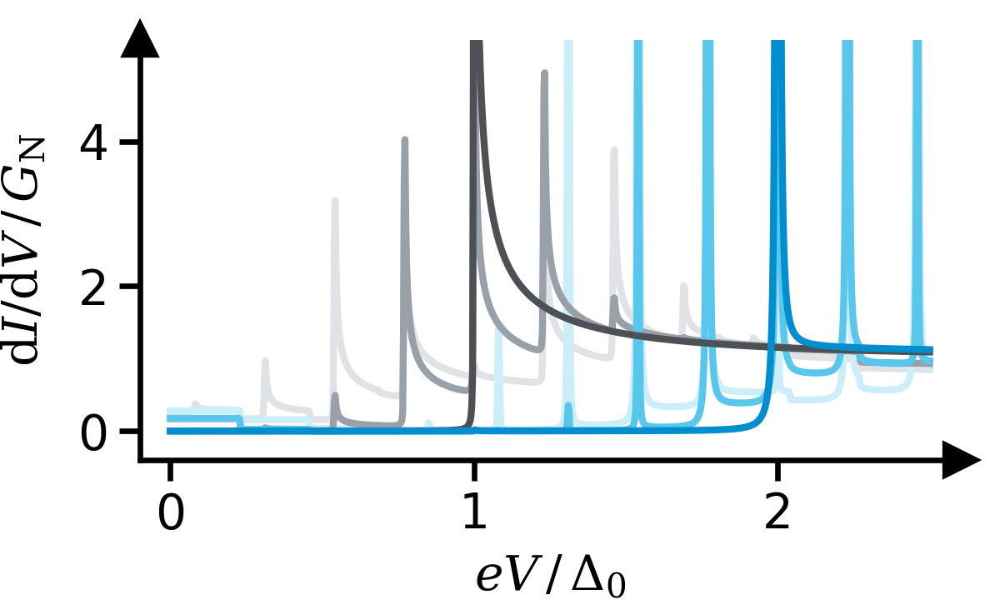
</p>

### Josephson / RSJ / Shapiro

<p align="center">
  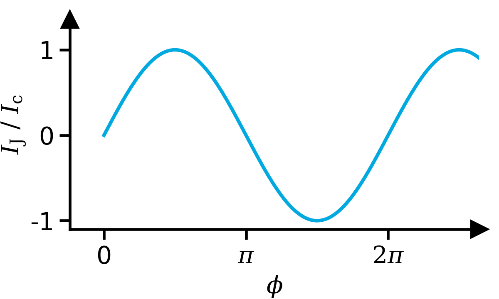
  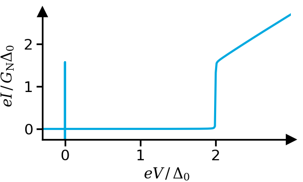
  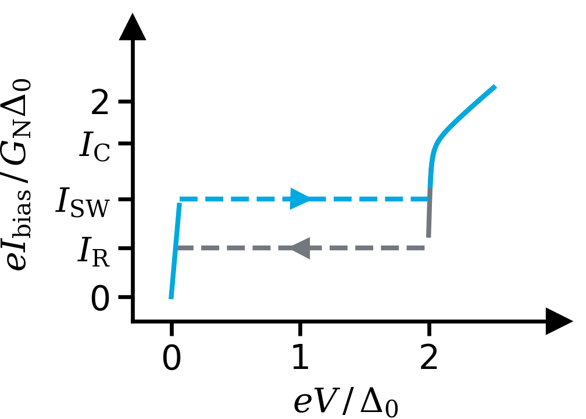
</p>

<p align="center">
  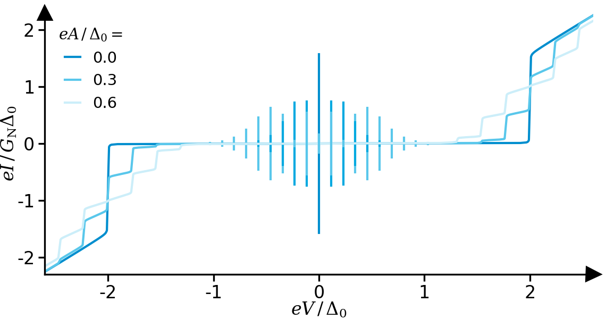
  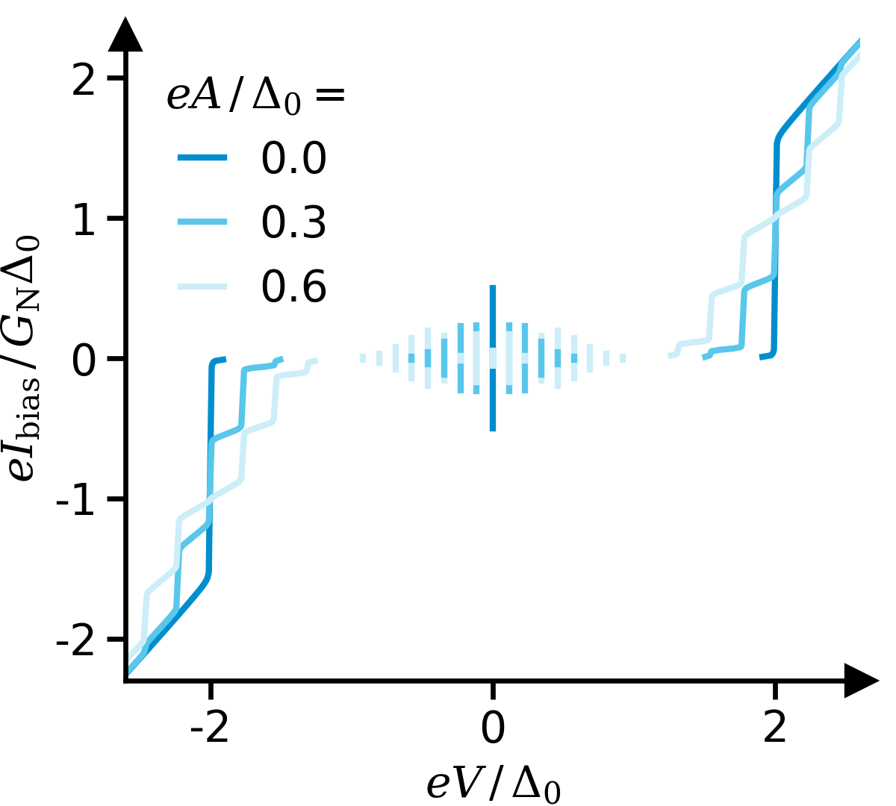
  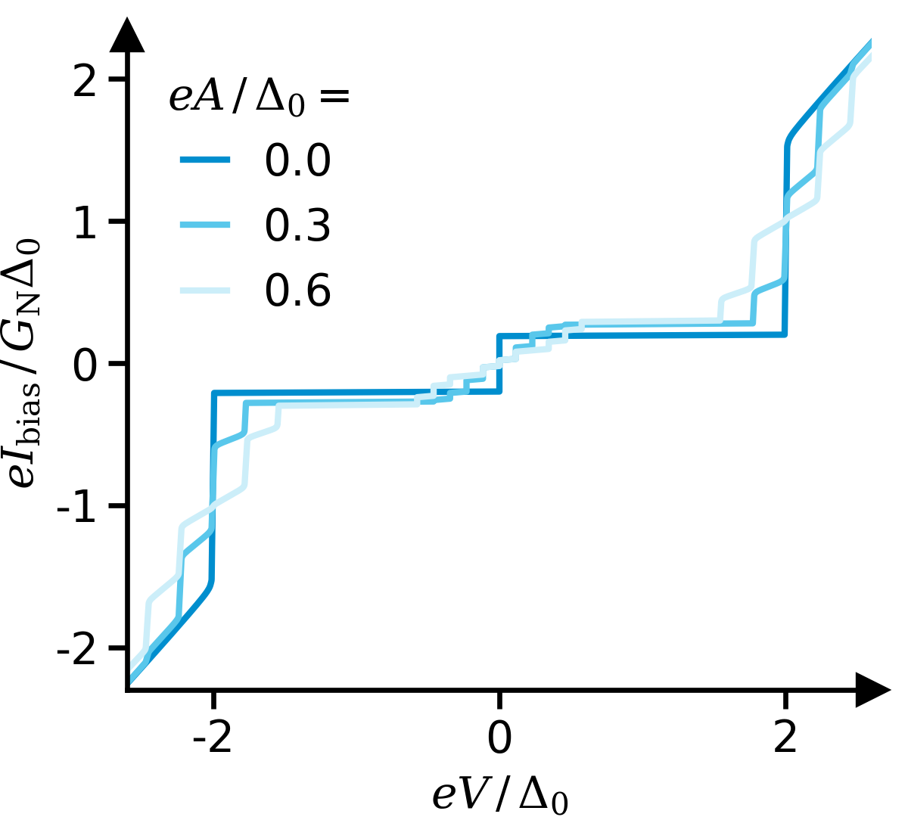
</p>

### Mesoscopic / ABS / BTK / MAR

<p align="center">
  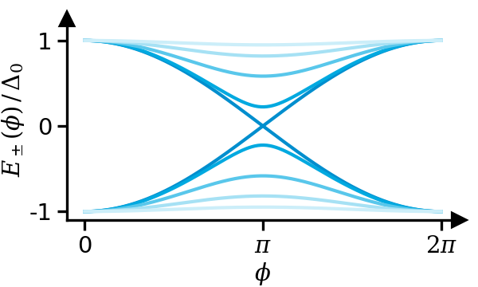
  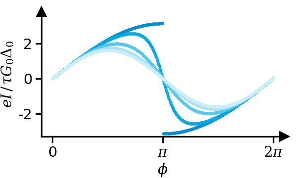
  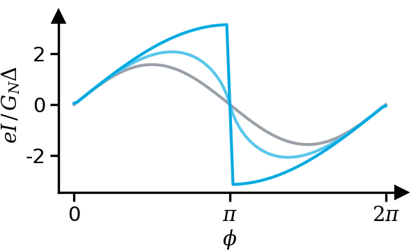
</p>

<p align="center">
  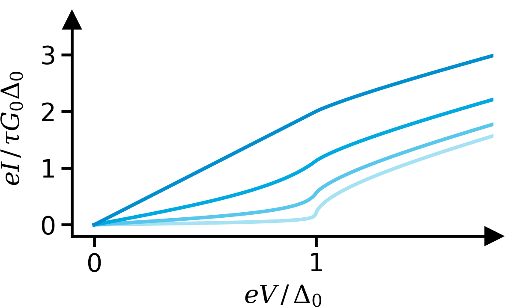
  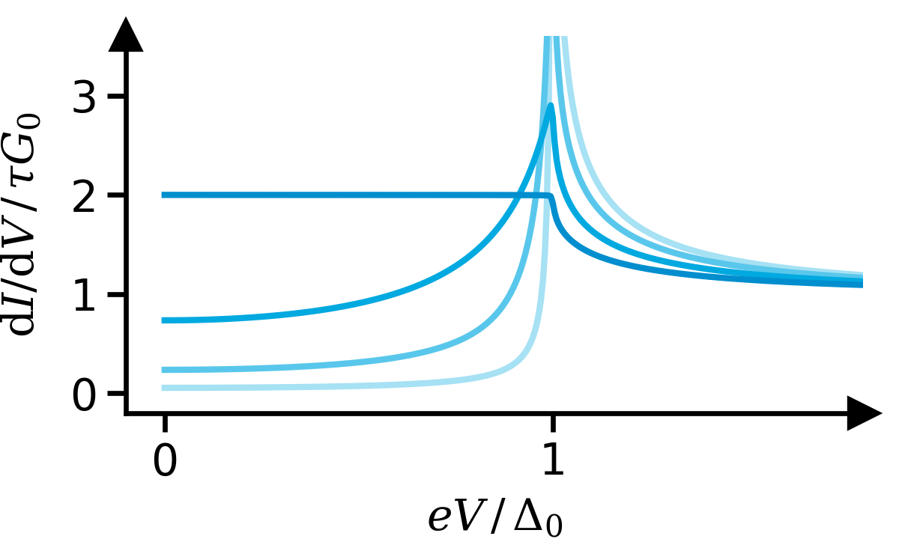
  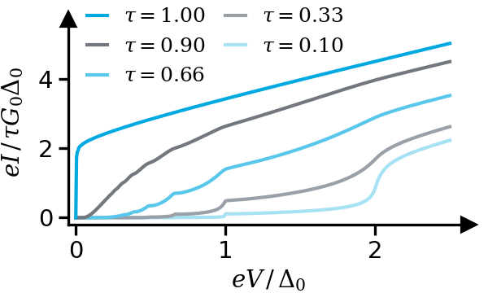
</p>

<p align="center">
  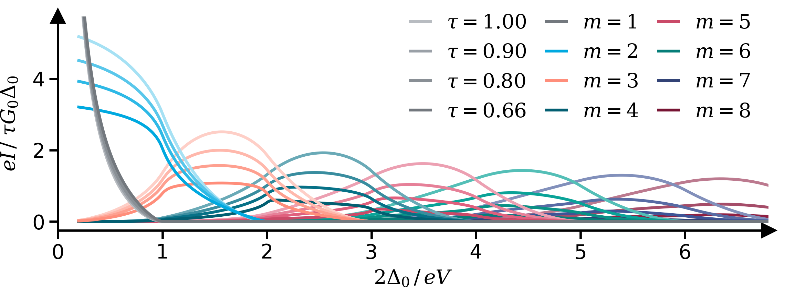
</p>

### Microwave notation helpers / macro relations

<p align="center">
  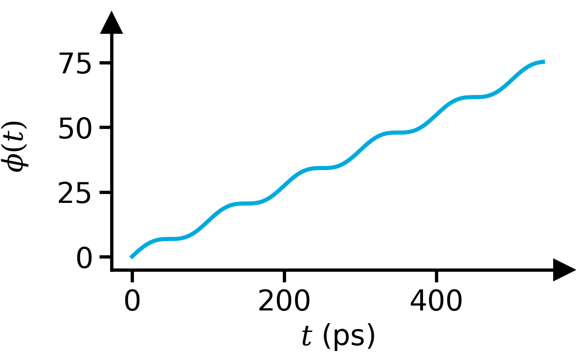
  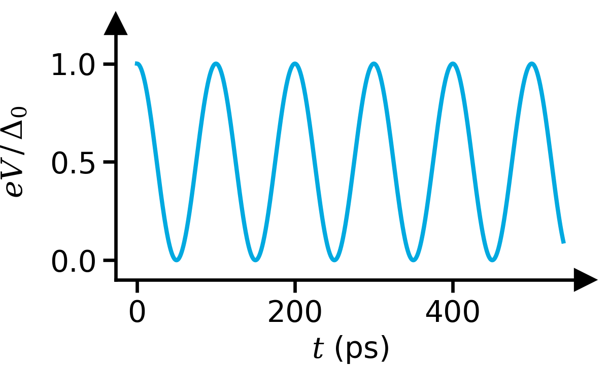
  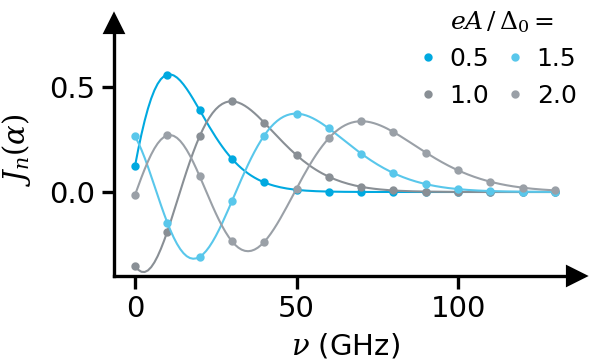
</p>

<p align="center">
  
  
</p>

---

## Development notes

- The repo follows a "curated API" approach: add new stable user-facing callables to `superconductivity/api.py`.
- Keep examples minimal and executable; if a new model is added, add a small regression test.
- If you add new theory figures, export them as PNG into `thesis/theory/` and embed them above.

## License

MIT (see `pyproject.toml`).
